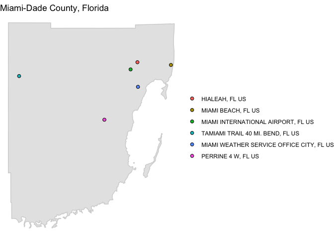

<!-- README.md is generated from README.Rmd. Please edit that file -->
While data from weather monitors is available at the specific location of the monitor, it is often useful to have estimates of daily or hourly weather aggregated on a larger spatial level. For U.S.-based studies, it can be particularly userful to be able to pull timeseries of weather by county. For example, the health data used in environmental epidemiology studies is often aggregated at the county level for U.S. studies, making it very useful for environmental epidemiology applications to be able to create weather datasets by county.

This package builds on functions from the `rnoaa` package to identify weather monitors within a county based on its FIPS code and then pull weather data for a specified date range from those monitors. It then does some additional cleaning and aggregating to produce a single, county-level weather dataset. Further, it maps the monitors used for that county and date range and allows you to create and write datasets for many different counties using a single function call.

Required set-up for this package
--------------------------------

Currently, this package exists in a development version on GitHub. To use the function, you need to install it directly from GitHub using the `install_github` function from `devtools`. The package relies on some functions that are in a development version of `rnoaa`, so you also need to install that development version of the `rnoaa` package, which is available in the GitHub repository `geanders/rnoaa`.

You can use the following code to install the development versions of `rnoaa` and `countyweather`:

``` r
library(devtools)

install_github("geanders/rnoaa")
library(rnoaa)

install_github("leighseverson/countyweather")
library(countyweather)
```

You will also need an API key from NOAA to be able to access the weather data. This API key is input with some of your data requests to NOAA within functions in this package. You can request an API key from NOAA here: <http://www.ncdc.noaa.gov/cdo-web/token>. You should keep this key private.

Once you have this NOAA API key, you'll need to pass it through to some of the functions in this package that pull data from NOAA. The most secure way to use this API key is to store it in your `.Renviron` configuration file, and then you can set it up as the value of an object in R code or R markdown documents without having to include the key itself in the script. To store the NOAA API key in your `.Renviron` configuration file, first check and see if you already have an `.Renviron` file in your home directory. You can check this by running the following from your R command line:

``` r
any(grepl("^\\.Renviron", list.files("~", all.files = TRUE)))
```

If this call returns `TRUE`, then you already have an `.Renviron` file.

If you already have it, open that file (for example, with `system("open ~/.Renviron")`). If you do not yet have an `.Renviron` file, open a new text file (in RStudio, do this by navigating to *File* &gt; *New File* &gt; *Text File*) and save this text file as `.Renviron` in your home directory. If prompted with a complaint, you DO want to use a filename that begins with a dot `.`

Once you have opened or created an `.Renviron` file, type the following into the file, replacing "your\_emailed\_key" with the actual string that NOAA emails you:

``` r
noaakey=your_emailed_key
```

Do not put quotation marks or anything else around your key. Do make sure to add a blank line as the last line of the file. If you find you're having problems getting this to work, go back and confirm that you've included a blank line as the last line in your `.Renviron` file. This is the most common reason for this part not working.

Next, you'll need to restart R. Once you restart R, you can get the value of this NOAA API key from `.Renviron` anytime with the call `Sys.getenv("noaakey")`. Before using functions that require the API key, set up the object `rnoaakey` to have your NOAA API key by running:

``` r
options("noaakey" = Sys.getenv("noaakey"))
```

This will pull your NOAA API key from the `.Renviron` file and save it as the object `noaakey`, which functions in this package need to pull weather data from NOAA's web services. You will want to put this line of code as one of the first lines of code in any R script or R Markdown file you write that uses functions from this package.

Basic examples of using the package
-----------------------------------

Weather data is collected at monitors, and there are often multiple weather monitors within a county. The `countyweather` package allows you to pull weather data from all monitors in a specified county over a specified date range. The two main functions in the countyweather package are `daily_fips` and `hourly_fips`, which pull daily and hourly weather data, respectively. By default, these values pulled from all monitors in a county will then be averaged for each time point to create an average timeseries of daily or hourly measurements for that county. There is also an option that allows the user to opt out of the default aggregation across weather stations, and instead pull separate timeseries for each monitor in the county. This option is explained in more detail later in this document. Opting out of the default aggregation can be useful if you would like to use a method other than a simple average to aggregate across monitors within a county.

Throughout, functions in this package identify a county using the county's Federal Information Processing Standard (FIPS) code. FIPS codes are 5-digit codes that uniquely identify every U.S. county. The first two digits of a county FIPS code specify state and the last three specify the county within the state. This package pulls data based on FIPS designations as of the 2010 Census. Users will not be able to pull data for the few FIPS codes that have undergone substantial changes since 2010 - for a list of those codes see the Census Bureau's [summary](https://www.census.gov/geo/reference/county-changes.html) of these counties for the 2010s.

Currently, this package can pull daily and hourly weather data for variables like temperature and precipitation. For resources with complete lists of weather variables available through this package, as well as sources of this weather data, see the section later in this document titled 'More on the weather data'.

### Pulling daily data

The `daily_fips` function can be used to pull daily weather data for all monitors within the geographic boundaries of a county. This daily weather data comes from NOAA's Global Historical Climatology Network. When pulling data for a county, the user can specify date ranges (`date_min`, `date_max`), which weather variables to include in the output dataset (`var`), and restrictions on how much non-missing data a monitor must have over the time period to be included when generating daily county average values (`coverage`). This function will pull any available data for monitors in the county under the specified restrictions and output both a dataset of average daily observations across all county monitors, as well as a map plotting the stations used in the county-wide averaged data.

Here is an example of creating a dataset with daily precipitation for Miami-Dade county (FIPS code = 12086) for August 1992, when Hurricane Andrew stuck:

``` r
andrew_precip <- daily_fips(fips = "12086", date_min = "1992-08-01", 
                            date_max = "1992-08-31", var = "prcp")
```

``` r
names(andrew_precip)
#> [1] "daily_data"       "station_metadata" "station_map"
```

The output from this function call is a list that includes three elements: a daily timeseries of weather data for the county (`andrew_precip$daily_data`); a dataframe with meta-data about the weather stations used to create the timeseries data, and a map showing the locations of weather monitors included in the county-averaged dataset (`anderew_precip$station_map`).

Here are the first few rows of the dataset:

``` r
head(andrew_precip$daily_data)
#> # A tibble: 6 x 3
#>         date     prcp prcp_reporting
#>       <date>    <dbl>          <int>
#> 1 1992-08-01 1.016667              6
#> 2 1992-08-02 8.850000              6
#> 3 1992-08-03 9.366667              6
#> 4 1992-08-04 5.483333              6
#> 5 1992-08-05 2.716667              6
#> 6 1992-08-06 1.633333              6
```

The dataset includes columns for date (`date`), precipitation (in mm, `prcp`), and also the number of stations used to calculate each daily average precipitation observation (`prcp_reporting`).

This function performs some simple data cleaning and quality control on the weather data originally pulled from NOAA's web services; see the 'More on the weather data' section later in this document for more details, including the units for the weather observations collected by this function.

Here is a plot of this data, with colors used to show the number of monitors included in each daily observation:

``` r
library(ggplot2)
ggplot(andrew_precip$daily_data, aes(x = date, y = prcp, color = prcp_reporting)) + 
  geom_line() + geom_point() + theme_minimal() + 
  xlab("Date in 1992") + ylab("Daily rainfall (mm)") + 
  scale_color_continuous(name = "# monitors\nreporting")
```


From this plot, you can see both the extreme precipitation associated with Hurricane Andrew (Aug. 24) and that the storm knocked out quite a few of the weather monitors normally available.

A map is also included in the output of `daily_fips` with the monitors used for the county average, as the `station_map` element:

``` r
andrew_precip$station_map
```


This map uses functions from the `choroplethr` package to overlay weather monitor locations on a shaded map showing the county's boundaries. According to the `choroplethrMaps` [reference manual](https://cran.r-project.org/web/packages/choroplethrMaps/choroplethrMaps.pdf), the `choroplethr` package took these county shapefiles from the U.S. Census 2010 [Cartographic Boundary shapefiles page](https://www.census.gov/geo/mapsdata/data/tiger-cart-boundary.html) in May 2014.

### Pulling hourly data

You can also use functions in the `countyweather` package to pull hourly wind speed and temperature data by county from NOAA's Integrated Surface Data (ISD) weather dataset. In this case, NOAA's web services will not identify weather monitors by FIPS, so instead this function will pull all monitors within a certain radius of the county's population mean center to represent weather within that county.

An estimated radius is calculated for each county using 2010 U.S. Census Land Area data - each county is assumed to be roughly ciruclar. The calculated radius (in km), as well as the longitude and latitude of the population-weighted center for each county are included as elements in the list returned from `hourly_fips`.

Here is an example of pulling hourly data for Miami-Dade, for the year of Hurricane Andrew. While daily weather data can be pulled using a date range specified to the day, hourly data can only be pulled by year (for one or multiple years) using the `year` argument:

``` r
andrew_hourly <- hourly_fips(fips = "12086", year = 1992,
                           var = c("wind_speed", "temperature"))
```

The output from this call is a list object that includes the dataset of hourly values (`hourly_data`). This dataset includes the date-time of the observation (given in UTC), values for the weather variables selected, and the number of monitors reporting for each observation of each weather variable:

``` r
head(andrew_hourly$hourly_data)
#>             date_time temperature wind_speed temperature_reporting
#> 1 1992-01-01 00:00:00    20.00000      2.600                     4
#> 2 1992-01-01 01:00:00    19.85000      1.960                     4
#> 3 1992-01-01 02:00:00    19.03333      2.975                     3
#> 4 1992-01-01 03:00:00    19.42500      1.960                     4
#> 5 1992-01-01 04:00:00    18.53333      1.760                     3
#> 6 1992-01-01 05:00:00    18.60000      2.575                     4
#>   wind_speed_reporting
#> 1                    5
#> 2                    5
#> 3                    4
#> 4                    5
#> 5                    5
#> 6                    4
```

If you need to get the timestamp for each observation in local time, you can use the `add_local_time` function from the `countytimezones` package to do that:

``` r
andrew_hourly_data <- as.data.frame(andrew_hourly$hourly_data) 

library(countytimezones)
```

``` r
andrew_hourly_data <- add_local_time(df = andrew_hourly_data, fips = "12086",
                                     datetime_colname = "date_time")
```

``` r
head(andrew_hourly_data)
#>             date_time temperature wind_speed temperature_reporting
#> 1 1992-01-01 00:00:00    20.00000      2.600                     4
#> 2 1992-01-01 01:00:00    19.85000      1.960                     4
#> 3 1992-01-01 02:00:00    19.03333      2.975                     3
#> 4 1992-01-01 03:00:00    19.42500      1.960                     4
#> 5 1992-01-01 04:00:00    18.53333      1.760                     3
#> 6 1992-01-01 05:00:00    18.60000      2.575                     4
#>   wind_speed_reporting       local_time local_date         local_tz
#> 1                    5 1991-12-31 19:00 1991-12-31 America/New_York
#> 2                    5 1991-12-31 20:00 1991-12-31 America/New_York
#> 3                    4 1991-12-31 21:00 1991-12-31 America/New_York
#> 4                    5 1991-12-31 22:00 1991-12-31 America/New_York
#> 5                    5 1991-12-31 23:00 1991-12-31 America/New_York
#> 6                    4 1992-01-01 00:00 1992-01-01 America/New_York
```

Here is a plot of hourly wind speeds for Miami-Dade County, FL, for the month of Hurricane Andrew:

``` r
library(dplyr)
library(lubridate)
to_plot <- andrew_hourly$hourly_data %>%
  filter(months(date_time) == "August")
ggplot(to_plot, aes(x = date_time, y = wind_speed,
                    color = wind_speed_reporting)) + 
  geom_line() + theme_minimal() + 
  xlab("Date in August 1992") + 
  ylab("Wind speed (m / s)") + 
  scale_color_continuous(name = "# monitors\nreporting")
```


Again, the intensity of conditions during Hurricane Andrew is clear, as is the reduction in the number of reporting monitors during the storm.

The list object returned by `hourly_fips` also includes a map of monitor locations (`station_map`):

``` r
andrew_hourly$station_map
#> Warning: Removed 1 rows containing missing values (geom_rect).
#> Warning: Removed 8 rows containing missing values (geom_point).
```


Writing out timeseries files
----------------------------

There are a few functions that allow the user to write out daily or hourly timeseries datasets as `.rds` files to a specified local directory, as well as plots of this data. For daily weather data, see the functions `daily_timeseries` and `plot_daily_timeseries`. For hourly, see `hourly_timeseries` and `plot_hourly_timeseries`.

For example, if we wanted to compare daily weather in the month of August for three counties in southern Florida, we could run:

``` r
fl_counties <- c("12086", "12087", "12011")

daily_timeseries(fips = fl_counties, date_min = "1992-08-01", 
                 date_max = "1992-08-31", var = "prcp", 
                 out_directory = "~/Documents/andrew_data")
```

`daily_timeseries()` saves each county's timeseries as a separate .rds file in the directory specified in the `out_directory` option. Each .rds file is a list including `daily_data`, which is the dataframe of daily weather data, `station_df`, which is the dataframe of station metadata, and `station_map`, which is a plot of the county showing locations of weather monitors contributing to the weather data. At this stage, if you were to include a county in the `fips` argument without available data, a file would not be created for that county.

The function `plot_daily_timeseries` creates and saves plots for each of these .rds files.

``` r
plot_daily_timeseries("prcp", file_directory = "~/Documents/andrew_data", 
                      plot_directory = "~/Documents/andrew_plots", 
                      date_min = "1992-08-01", date_max = "1992-08-31")
```

Here's an example of what the timeseries plots for the three Florida counties would look like:



Futher options available in the package
---------------------------------------

### `coverage`

For `hourly_fips()` and `daily_fips()`, and timeseries functions, the user can choose to filter out any monitors that report variables for less that a certain percent of time (`coverage`). For example, if you were to set `coverage` to 0.90, only monitors that reported non-missing values at least 90% of the time would be included in your data.

### `average_data`

In both `daily_fips()` and `hourly_fips()`, the default ise to return a single daily average for the county for each day in the timeseries, giving the value averaged across all available monitors on that day. However, there is also an option called `average_data` which allows the user to specify whether they would like the weather data returned before it has been averaged across monitors. If this argument is set to `FALSE`, the functions will return separate daily data for each monitor in the county. For our Hurricane Andrew example, if we specify `average_data = FALSE`:

``` r
not_averaged <- daily_fips(fips = "12086", 
                           date_min = "1992-08-01", 
                           date_max = "1992-08-31",
                           var = "prcp", average_data = FALSE, 
                           station_label = TRUE)
save(not_averaged, file = "data/not_averaged.RData")
```

``` r
not_averaged_data <- not_averaged$daily_data
head(not_averaged_data)
#> # A tibble: 6 x 3
#>            id       date  prcp
#>         <chr>     <date> <dbl>
#> 1 USC00083909 1992-08-01   1.3
#> 2 USC00083909 1992-08-02   4.8
#> 3 USC00083909 1992-08-03   1.3
#> 4 USC00083909 1992-08-04   0.0
#> 5 USC00083909 1992-08-05   7.6
#> 6 USC00083909 1992-08-06   1.0
unique(not_averaged_data$id)
#> [1] "USC00083909" "USC00087020" "USC00088780" "USW00012839" "USW00012859"
#> [6] "USW00092811"
```

In this example, there are six monitors contributing weather data to the timeseries. We can plot the data by station to get a sense for how values from each monitor compare, and which monitors were presumably knocked out by the storm, with different colors used to show values for different monitors:

``` r
library(ggplot2)
ggplot(not_averaged_data, aes(x = date, y = prcp, 
                         colour = id)) + 
  geom_line() + 
  theme_minimal() 
```


It might be interesting here to compare this plot with the station map, this time with station labels included:

``` r
not_averaged$station_map
```


### Quality Flags

The hourly Integrated Surface Data includes quality codes for each of the main weather variables. For more information about the hourly weather variables, see the 'More on the weather data' section below. We can use these codes to remove suspect or erroneous values from our data. The values in `wind_speed_quality` take on the following values:

<table>
<colgroup>
<col width="7%" />
<col width="92%" />
</colgroup>
<thead>
<tr class="header">
<th align="right">code</th>
<th align="left">definition</th>
</tr>
</thead>
<tbody>
<tr class="odd">
<td align="right">0</td>
<td align="left">Passed gross limits check</td>
</tr>
<tr class="even">
<td align="right">1</td>
<td align="left">Passed all quality control checks</td>
</tr>
<tr class="odd">
<td align="right">2</td>
<td align="left">Suspect</td>
</tr>
<tr class="even">
<td align="right">3</td>
<td align="left">Erroneous</td>
</tr>
<tr class="odd">
<td align="right">4</td>
<td align="left">Passed gross limits check , data originate from an NCEI data source</td>
</tr>
<tr class="even">
<td align="right">5</td>
<td align="left">Passed all quality control checks, data originate from an NCEI data source</td>
</tr>
<tr class="odd">
<td align="right">6</td>
<td align="left">Suspect, data originate from an NCEI data source</td>
</tr>
<tr class="even">
<td align="right">7</td>
<td align="left">Erroneous, data originate from an NCEI data source</td>
</tr>
<tr class="odd">
<td align="right">9</td>
<td align="left">Passed gross limits check if element is present</td>
</tr>
</tbody>
</table>

Because it makes no sense to average these codes across monitors, the codes should only be pulled when using the option to pull monitor-specific values (`average_data = FALSE`).

``` r
ex <- hourly_fips("12086", 1992, var = c("wind_speed", "wind_speed_quality"), 
                  average_data = FALSE)
```

``` r
ex_data <- ex$hourly_data
head(ex_data)
#> # A tibble: 6 x 7
#>   usaf_station wban_station           date_time latitude longitude
#>          <dbl>        <dbl>              <time>    <dbl>     <dbl>
#> 1       722020        12839 1992-01-01 00:00:00     25.8     -80.3
#> 2       722020        12839 1992-01-01 01:00:00     25.8     -80.3
#> 3       722020        12839 1992-01-01 02:00:00     25.8     -80.3
#> 4       722020        12839 1992-01-01 03:00:00     25.8     -80.3
#> 5       722020        12839 1992-01-01 04:00:00     25.8     -80.3
#> 6       722020        12839 1992-01-01 05:00:00     25.8     -80.3
#> # ... with 2 more variables: wind_speed <dbl>, wind_speed_quality <chr>
```

We can replace all wind speed observations with quality codes of 2, 3, 6, or 7 with `NA`s.

``` r
ex_data$wind_speed_quality <- as.numeric(ex_data$wind_speed_quality)
ex_data$wind_speed[ex_data$wind_speed_quality == 2|3|6|7] <- NA
```

More on the weather data
------------------------

### Daily weather data

Functions in this package that pull daily weather values (`daily_fips()`, for example) are pulling data from the Daily Global Historical Climatology Network (GHCN-Daily) through NOAA's FTP server.

Users can specify which weather variables they would like to pull. The five core daily weather variables are precipitation (`prcp`), snowfall (`snow`), snow depth (`snwd`), maximum temperature (`tmax`) and minimum temperature (`tmin`). The daily weather data is filtered so that included weather variables fall within a range of possible values. These ranges were chosen to include national maximum recorded values.

| variables | description         | units           | most\_extreme\_value |
|:----------|:--------------------|:----------------|:---------------------|
| prcp      | precipitation       | mm              | 1100 mm              |
| snow      | snowfall            | mm              | 1600 mm              |
| snwd      | snow depth          | mm              | 11500 mm             |
| tmax      | maximum temperature | degrees Celsius | 57 degrees C         |
| tmin      | minumum temperature | degrees Celsius | -62 degrees C        |

`tmax`, `tmin`, and `prcp` were originally recorded in tenths of units, and are listed as such in NOAA documentation. These values are converted to standard units (degrees Celsius and mm, respectively) in `countyweather` output.

The daily weather function defaults to pull these five core weather variables. However, there are several additional, non-core variables available. For example, `acmc` gives the "average cloudiness midnight to midnight from 30-second ceilometer data (percent)." The complete list of available weather variables can be found under 'element' from the GHCND's [readme file](http://www1.ncdc.noaa.gov/pub/data/ghcn/daily/readme.txt).

While the datasets resulting from functions in this package return a cleaned and aggregated dataset, Menne et al. (2012) give more information aboout the raw data in the GHCND database.

### Hourly weather data

Hourly weather data in this package is pulled from NOAA's Integrated Surface Data (ISD), which is archived at the National Climatic Data Center (NCDC). This data is also pulled through NOAA's FTP server.

The seven core hourly weather variables include `wind_direction`, `wind_speed`, `ceiling_height`, `visibility_distance`, `temperature`, `temperature_dewpoint`, and `air_pressure`. Values in this table were pulled from the [ISD documentation file](ftp://ftp.ncdc.noaa.gov/pub/data/noaa/ish-format-document.pdf).

<table>
<colgroup>
<col width="7%" />
<col width="73%" />
<col width="6%" />
<col width="2%" />
<col width="10%" />
</colgroup>
<thead>
<tr class="header">
<th align="left">variable</th>
<th align="left">description</th>
<th align="left">units</th>
<th align="left">minimum</th>
<th align="left">maximum</th>
</tr>
</thead>
<tbody>
<tr class="odd">
<td align="left">wind_direction</td>
<td align="left">The angle, measured in a clockwise direction, between true north and the direction from which the wind is blowing</td>
<td align="left">Angular Degrees</td>
<td align="left">1</td>
<td align="left">360</td>
</tr>
<tr class="even">
<td align="left">wind_speed</td>
<td align="left">The rate of horizontal travel of air past a fixed point</td>
<td align="left">Meters per Second</td>
<td align="left">0</td>
<td align="left">90</td>
</tr>
<tr class="odd">
<td align="left">ceiling_height</td>
<td align="left">The height above ground level of the lowest cloud or obscuring phenomena layer aloft with 5/8 or more summation total sky cover, which may be predominately opaque, or the vertical visibility into a surface-based obstruction</td>
<td align="left">Meters</td>
<td align="left">0</td>
<td align="left">22000 (indicates 'Unlimited')</td>
</tr>
<tr class="even">
<td align="left">visibility_distance</td>
<td align="left">The horizontal distance at which an object can be seen and identified</td>
<td align="left">Meters</td>
<td align="left">0</td>
<td align="left">160000</td>
</tr>
<tr class="odd">
<td align="left">temperature</td>
<td align="left">The temperature of the air</td>
<td align="left">Degrees Celsuis</td>
<td align="left">-93.2</td>
<td align="left">61.8</td>
</tr>
<tr class="even">
<td align="left">temperature_dewpoint</td>
<td align="left">The temperature to which a given parcel of air must be cooled at constant pressure and water vapor content in order for saturation to occur</td>
<td align="left">Degrees Celsius</td>
<td align="left">-98.2</td>
<td align="left">36.8</td>
</tr>
<tr class="odd">
<td align="left">air_pressure</td>
<td align="left">The air pressure relative to Mean Sea Level</td>
<td align="left">Hectopascals</td>
<td align="left">860</td>
<td align="left">1090</td>
</tr>
</tbody>
</table>

There are other columns available in addition to these weather variables such as quality codes. For example, `wind_direction_quality` - each of the main weather variables has a corresponding quality code that can be pulled by adding `_quality` to the end of the variable name.

For more information about the weather variables described in the above table and other available columns, see the [ISD documentation file](ftp://ftp.ncdc.noaa.gov/pub/data/noaa/ish-format-document.pdf).

Error and warning messages you may get
--------------------------------------

### Not able to pull data from a monitor

The following error message will come up after running functions pulling daily data if there isn't available data (for your specified date range, coverage, and weather variables) for a particular monitor or monitors:

``` r
In rnoaa::meteo_pull_monitors(monitors = stations, keep_flags = FALSE,  :
  The following stations could not be pulled from the GHCN ftp:
 USR0000FTEN 
 Any other monitors were successfully pulled from GHCN.
```

This error message will come up after running functions pulling hourly data (`hourly_fips()`) if there isn't available data for any of the monitors in your specified county. Note: some weather variables tend to be missing more often than others.

``` r
Error in isd_monitors_data(fips = fips, year = x, var = var, radius = radius) : 
  None of the stations had available data.
```

This error message will come up after running or if the function is unable to pull data for a particular fips code in your `fips` vector:

``` r
Unable to pull weather data for FIPS code "12086" for the specified percent coverage, year(s), and/or weather variables.
```

### Need an API key for NOAA data

If you run functions that use NOAA API calls without first requesting an API key from NOAA and setting up the key in your R session, you will see the following error message:

``` r
Error in getOption("noaakey", stop("need an API key for NOAA data")) : 
  need an API key for NOAA data
```

If you get this error message, run the code:

``` r
options("noaakey" = Sys.getenv("noaakey"))
```

and then try again. If you still get an error, you may not have set up your NOAA API key correctly in your `.Renviron` file. See the "Required set-up" section of this document for more details on doing that correctly.

### NOAA web services down

Sometimes, some of NOAA's web services will be off-line. In this case, you may get an error message when you try to pull data like:

`Error in gzfile(file, mode) : cannot open the connection`

In this case, try again in a new R session. If you're still getting this error, wait a few hours and then try again.

### Other errors

If you get other error messages or run into problems with this package, please submit a reproducible example on this repository's Issues page.

References
----------

Menne, Matthew J, Imke Durre, Russell S Vose, Byron E Gleason, and Tamara G Houston. 2012. “An Overview of the Global Historical Climatology Network-Daily Database.” Journal of Atmospheric and Oceanic Technology 29 (7): 897–910.
