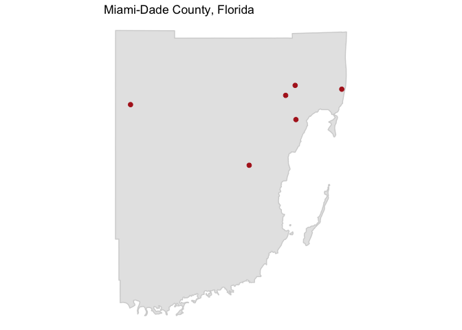

<!-- README.md is generated from README.Rmd. Please edit that file -->
Setting up to use the package
-----------------------------

Currently, this package exists in a development version on GitHub. To use the function, you need to install it directly from GitHub using the `install_github` function from `devtools`. Further, the package relies on some functions that are in a development version of `rnoaa`, so you need to install that version of the `rnoaa` package.

You can use the following code for this set-up:

``` r
library(devtools)

install_github("ropenscilabs/rnoaa")
library(rnoaa)

install_github("leighseverson/countyweather")
library(countyweather)
```

You will also need an API key from NOAA to be able to access the weather data. You can get one by requesting that NOAA email you an API key from here: <http://www.ncdc.noaa.gov/cdo-web/token>

Next, open a new text file (in RStudio, do this by navigating to *File* &gt; *New File* &gt; *Text File*). Type the following, and make sure to add a second blank line:

``` r
noaakey=your_key
```

Save this text file as `.Renviron` in your home directory. (If prompted with a complaint, you DO want to use a filename that begins with a dot `.`. Once you restart R, you can pull your key using `Sys.getenv("noaakey")`. Before using functions that require the API key, run:

``` r
options("noaakey" = Sys.getenv("noaakey"))
```

This package draws mainly on functions from the `rnoaa` package to identify weather monitors within a county based on its FIPS code and then pull weather data for a specified date range from those monitors. It then does some additional cleaning and aggregating to produce a single, county-level weather dataset. Further, it maps the monitors used for that county and date range and allows you to create and write datasets for many different counties using a single function call.

Basic examples of using the package
-----------------------------------

This package allows you to pull data based on a US county's corresponding Federal Information Processing Standard (FIPS) code. FIPS codes are 5-digit codes that uniquely identify every US county. The first two digits specify state and the last three specify the county within the state. The health data used in environmental epidemiology studies is often aggregated at the county level for US studies, making it very useful to be able to create weather datasets by county.

Currently, this package can pull daily and hourly weather data for variables like temperature and precipitation. (For resources with complete lists of available weather variables, see the section titled 'More on the weather data'). The weather data is collected at monitors, and there are often multiple weather monitors within a county. This package allows you to specify a county and then will pull weather data from all monitors in that county over a specified date range, and average the daily or hourly values to generate an average time series for that county.

### Pulling daily data

Here is an example of creating a dataset with daily precipitation for Miami-Dade county (FIPS = 12086) for August 1992, when Hurricane Andrew stuck:

``` r
andrew_precip <- daily_fips(fips = "12086", 
                            date_min = "1992-08-01", 
                            date_max = "1992-08-31",
                            var = "PRCP")
```

The output from this function call includes both the weather dataset (`andrew_precip$weather_data`) and a map showing the locations of weather monitors included in the county-averaged dataset (`anderew_precip$station_map`).

Here are the first few rows of the dataset:

``` r
head(andrew_precip$daily_data)
#> Source: local data frame [6 x 3]
#> Groups: date [6]
#> 
#>         date     prcp prcp_reporting
#>       <date>    <dbl>          <int>
#> 1 1992-08-02 8.850000              6
#> 2 1992-08-03 9.366667              6
#> 3 1992-08-04 5.483333              6
#> 4 1992-08-05 2.716667              6
#> 5 1992-08-06 1.633333              6
#> 6 1992-08-07 7.200000              6
```

The dataset includes columns for date (`date`), precipitation (in mm, `prcp`), and also the number of stations used to calculated each precipitation observation (`prcp_reporting`).

Here is a plot of this data:

``` r
library(ggplot2)
ggplot(andrew_precip$daily_data, aes(x = date, y = prcp,
                                     color = prcp_reporting)) + 
  geom_line() + 
  theme_minimal() + 
  xlab("Date in 1992") + ylab("Daily rainfall (mm)") + 
  scale_color_continuous(name = "# monitors\nreporting")
```


From this plot, you can see both the extreme precipitation associated with Hurricane Andrew and that the storm knocked out quite a few of the weather monitors normally available.

To see a map of the monitors used for the county average, run:

``` r
andrew_precip$station_map
```


### Pulling hourly data

Here is an example of pulling hourly data for Miami-Dade, again for the period around Hurricane Andrew:

``` r
andrew_hourly <- hourly_df(fips = "12086", year = 1992,
                           var = c("wind_speed", "temperature"))
#> [1] "Getting hourly weather monitors for Miami-Dade County, Florida"
#> [1] "Getting hourly weather monitors for Miami-Dade County, Florida"
```

The output from this call includes the date-time of the observation (given in UTC), values for the weather variables selected, and the number of monitors reporting for each observation of each weather variable:

``` r
head(andrew_hourly$hourly_data)
#> Source: local data frame [6 x 5]
#> Groups: date_time [6]
#> 
#>             date_time temperature wind_speed temperature_reporting
#>                <time>       <dbl>      <dbl>                 <int>
#> 1 1992-01-01 00:00:00    20.00000   2.166667                     4
#> 2 1992-01-01 01:00:00    19.85000   1.633333                     4
#> 3 1992-01-01 02:00:00    19.03333   2.380000                     3
#> 4 1992-01-01 03:00:00    19.42500   1.960000                     4
#> 5 1992-01-01 04:00:00    18.53333   1.466667                     3
#> 6 1992-01-01 05:00:00    18.60000   2.060000                     4
#> # ... with 1 more variables: wind_speed_reporting <int>
```

Here are hourly values for the month of Hurricane Andrew:

``` r
library(dplyr)
library(lubridate)
to_plot <- andrew_hourly$hourly_data %>%
  filter(months(date_time) == "August")
ggplot(to_plot, aes(x = date_time, y = wind_speed,
                    color = wind_speed_reporting)) + 
  geom_line() + theme_minimal() + 
  xlab("Date in August 1992") + 
  ylab("Wind speed (m / s)") + 
  scale_color_continuous(name = "# monitors\nreporting")
```



Futher options available in the package
---------------------------------------

For hourly and daily weather, the user can choose to filter out any monitors that report variables for less that a certain percent of time (`coverage`). For example, if you were to set `coverage` to 0.90, only monitors that reported non-missing values at least 90% of the time would be included in your data.

Also, there are a few functions that allow the user to write out daily or hourly timeseries datasets as RDS or CSV files to a specified local directory, as well as plots of this data. For daily weather data, see the functions and . For hourly, see and .

More on the weather data
------------------------

### Daily weather data

Functions in this package that pull daily weather values (`weather_fips()`, for example) are pulling data from the Daily Global Historical Climatology Network (GHCN-Daily) through NOAA's FTP server.

Users can specify which weather variables they would like to pull. The five core daily weather variables are precipitation (`PRCP`), snowfall (`SNOW`), snow depth (`SNWD`), maximum temperature (`TMAX`) and minimum temperature (`TMIN`). The daily weather data is filtered so that included weather variables fall within a range of possible values. These ranges were chosen to include national maximum recorded values.

| variables | description         | units           | most\_extreme\_value |
|:----------|:--------------------|:----------------|:---------------------|
| PRCP      | precipitation       | mm              | 1100 mm              |
| SNOW      | snowfall            | mm              | 1600 mm              |
| SNWD      | snow depth          | mm              | 11500 mm             |
| TMAX      | maximum temperature | degrees Celsius | 57 degrees C         |
| TMIN      | minumum temperature | degrees Celsius | -62 degrees C        |

The daily weather function defaults to pull these five core weather variables. However, there are several additional, non-core variables available (for example, `ACMC` gives the "average cloudiness midnight to midnight from 30-second ceilometer data (percent))." The complete list of available weather variables can be found under 'element' from the GHCND's [readme file](http://www1.ncdc.noaa.gov/pub/data/ghcn/daily/readme.txt).

While the datasets resulting from functions in this package return a cleaned and aggregated dataset, this journal article by Menne et al. (2012) gives more information aboout the raw data in the GHCND database:

Menne, M.J., I. Durre, R.S. Vose, B.E. Gleason, and T.G. Houston, 2012: An overview of the Global Historical Climatology Network-Daily Database. Journal of Atmospheric and Oceanic Technology, 29, 897-910, <doi:10.1175/JTECH-D-11-00103.1>.

### Hourly weather data

Hourly weather data in this package is pulled from NOAA's Integrated Surface Data (ISD), which is archived at the National Climatic Data Center (NCDC). This data is also pulled through NOAA's FTP server.

Available hourly weather variables include `wind_direction`, `wind_speed`, `ceiling_height`, `visibility_distance`, `temperature`, `temperature_dewpoint`, and `air_pressure`.

``` r
library(knitr)
kable(hourly_vars, format = "markdown")
```

<table>
<colgroup>
<col width="7%" />
<col width="73%" />
<col width="6%" />
<col width="2%" />
<col width="10%" />
</colgroup>
<thead>
<tr class="header">
<th align="left">variable</th>
<th align="left">description</th>
<th align="left">units</th>
<th align="left">minimum</th>
<th align="left">maximum</th>
</tr>
</thead>
<tbody>
<tr class="odd">
<td align="left">wind_direction</td>
<td align="left">The angle, measured in a clockwise direction, between true north and the direction from which the wind is blowing</td>
<td align="left">Angular Degrees</td>
<td align="left">1</td>
<td align="left">360</td>
</tr>
<tr class="even">
<td align="left">wind_speed</td>
<td align="left">The rate of horizontal travel of air past a fixed point</td>
<td align="left">Meters per Second</td>
<td align="left">0</td>
<td align="left">90</td>
</tr>
<tr class="odd">
<td align="left">ceiling_height</td>
<td align="left">The height above ground level of the lowest cloud or obscuring phenomena layer aloft with 5/8 or more summation total sky cover, which may be predominately opaque, or the vertical visibility into a surface-based obstruction</td>
<td align="left">Meters</td>
<td align="left">0</td>
<td align="left">22000 (indicates 'Unlimited')</td>
</tr>
<tr class="even">
<td align="left">visibility_distance</td>
<td align="left">The horizontal distance at which an object can be seen and identified</td>
<td align="left">Meters</td>
<td align="left">0</td>
<td align="left">160000</td>
</tr>
<tr class="odd">
<td align="left">temperature</td>
<td align="left">The temperature of the air</td>
<td align="left">Degrees Celsuis</td>
<td align="left">-93.2</td>
<td align="left">61.8</td>
</tr>
<tr class="even">
<td align="left">temperature_dewpoint</td>
<td align="left">The temperature to which a given parcel of air must be cooled at constant pressure and water vapor content in order for saturation to occur</td>
<td align="left">Degrees Celsius</td>
<td align="left">-98.2</td>
<td align="left">36.8</td>
</tr>
<tr class="odd">
<td align="left">air_pressure</td>
<td align="left">The air pressure relative to Mean Sea Level</td>
<td align="left">Hectopascals</td>
<td align="left">860</td>
<td align="left">1090</td>
</tr>
</tbody>
</table>

There are other columns available in addition to these weather variables such as quality codes (for example, `wind_direction_quality`). For more information about the weather variables described in the above table and other available columns, see the [ISD documentation file](ftp://ftp.ncdc.noaa.gov/pub/data/noaa/ish-format-document.pdf). \#\# Error and warning messages you may get

### Not able to pull data from a monitor

The following error message will come up if there isn't available data (for your specified date range, coverage, and weather variables) for a particular monitor or monitors:

`In rnoaa::meteo_pull_monitors(monitors = stations, keep_flags = FALSE,  :   The following stations could not be pulled from the GHCN ftp:  USR0000FTEN   Any other monitors were successfully pulled from GHCN.`
