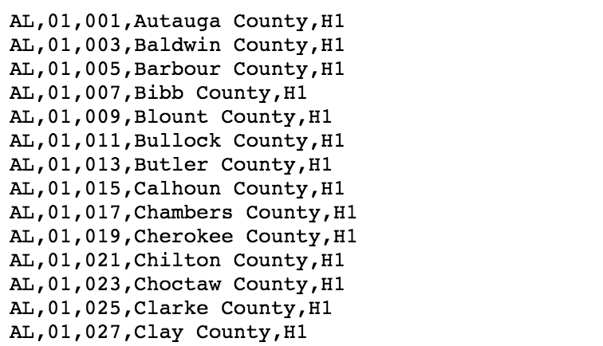
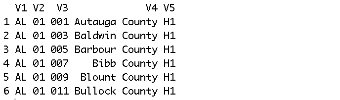
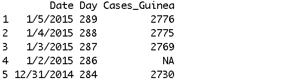
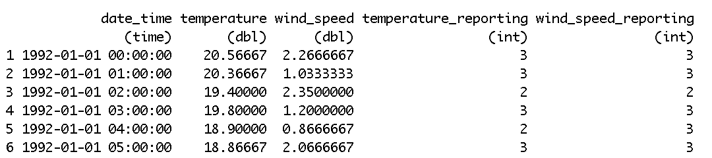
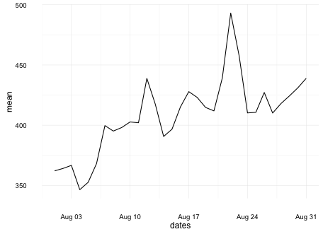
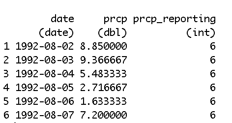
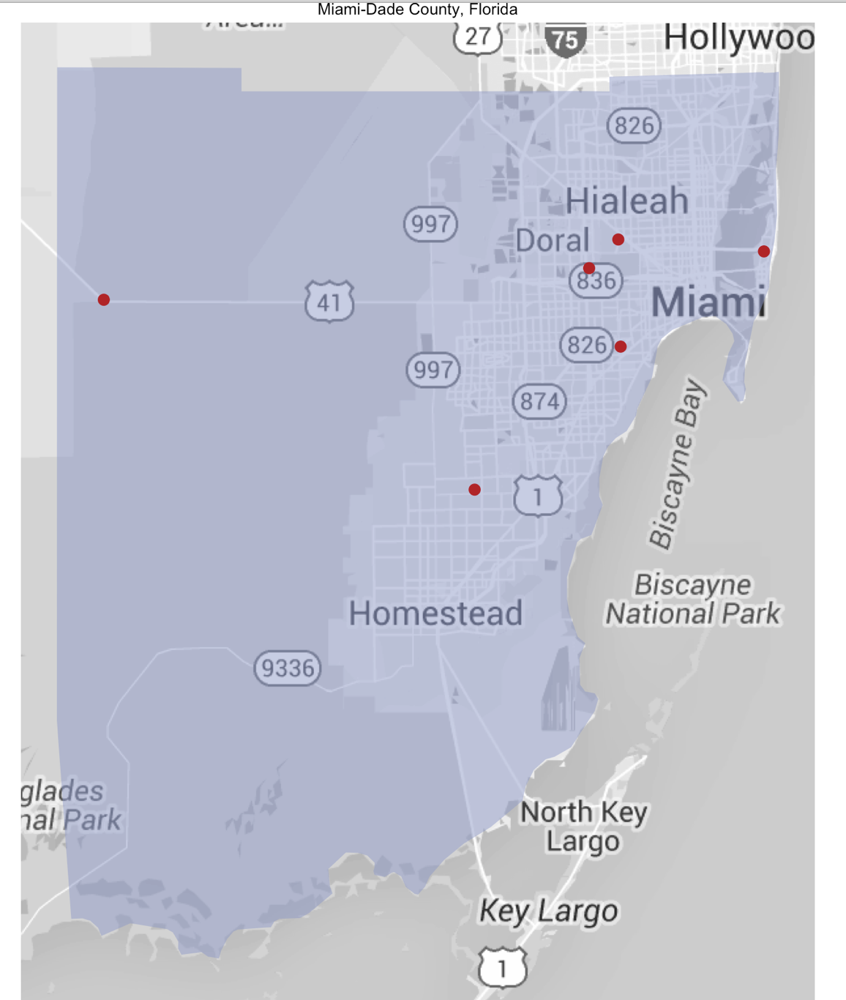
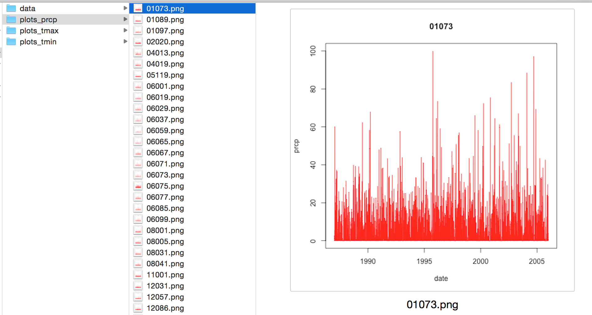
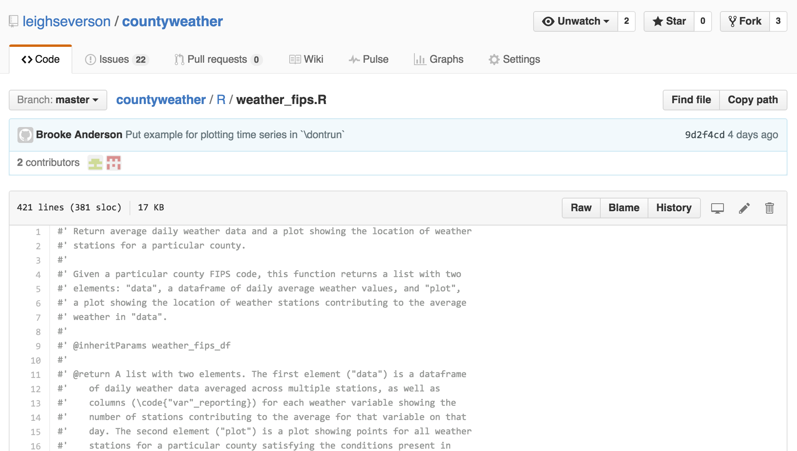

Working with online data in R
===
author: Rachel Severson
date: June 8, 2016


===

Reading in a data table from online

http://www2.census.gov/geo/docs/reference/codes/files/national_county.txt



===

With `read.csv()`, you can read in a file in table format and save it as a
`data.frame`:


```r
url <- paste0("http://www2.census.gov/geo/docs/",
              "reference/codes/files/",
              "national_county.txt")
  county_names <- read.csv(url, header = FALSE, colClasses = "character")
head(county_names)
```



Reading in 'secure' websites
===


```r
install.packages("repmis")
library(repmis)
url <- paste0("https://raw.githubuser",
              "content.com/cmrivers/ebola",
              "/master/country_",
              "timeseries.csv")
ebola <- source_data(url)
```

Reading in 'secure' websites
===


```r
ebola[1:5, 1:3]
```



Web scraping
===

Once you can read in files, it can be useful to loop through many at a time.

- USGS Site Web Service URL Generation Tool

```r
url <- paste0("http://waterservices.",
              "usgs.gov/nwis/site/?",
              "format=rdb&countyCd=",
              "12086&startDT=1992-08-01",
              "&endDT=1992-08-31&output",
              "DataTypeCd=dv&parameterCd",
              "=00060&siteType=ST")
```

Web scraping
===


```r
strsplit(url, "[?|&]")
```

```
[[1]]
[1] "http://waterservices.usgs.gov/nwis/site/"
[2] "format=rdb"                              
[3] "countyCd=12086"                          
[4] "startDT=1992-08-01"                      
[5] "endDT=1992-08-31"                        
[6] "outputDataTypeCd=dv"                     
[7] "parameterCd=00060"                       
[8] "siteType=ST"                             
```

Web scraping
===


```r
stations <- function(fips, date_min, date_max){
  url <- paste0("http://waterservices.usgs",
                ".gov/nwis/site/?format=rdb",
                "&countyCd=", fips,
                "&startDT=", date_min,
                "&endDT=", date_max,
                "&outputDataTypeCd=dv&param",
                "eterCd=00060&siteType=ST")

  ...

}
```

Web scraping
===


```r
stream_stations <- function(fips, date_min, date_max){

  ...

  data <- read.table(url, sep = "\t",
                     comment.char = "#",
                     header = TRUE)

}
```

Working with APIs
===

- 'Application Program Interface'
- provides building blocks for developing a program

- NOAA's API

===

`countyweather` package


- `rnoaa` package
- increasing accessibility/ease of use

===

`countyweather` package


ROpenSci develops "open scource R packages that provide programmatic access to a variety of scientific data."

===

`countyweather` package

- clean raw data to produce daily and hourly timeseries files
- user-specified counties/communities, date ranges, and weather variables

Creating an example dataset: Hurricane Andrew
===

Hourly weather data


```r
andy_hourly <- hourly_fips_df(fips = "12086",
                              year = 1992,
                              var = "wind_speed")
head(andy_hourly)
```

Creating an example dataset: Hurricane Andrew
===

Hourly weather data


```r
hourly <- hourly_fips_df(fips = "12086",
                         year = 1992,
                         var = c("temperature",
                                 "wind_speed")
head(hourly)
```



Hourly
===


```r
to_plot <- andrew_hourly %>%
  filter(months(date_time) == "August")
  ggplot(to_plot,
         aes(x = date_time,
             y = wind_speed,
             color = wind_speed_reporting)) +
         geom_line() +
         theme_minimal()
```

Hourly
===


Stream guage data
===

```r
streams <- stream_data(fips = "12086",
                       date_min = "1992-08-01",
                       date_max = "1992-08-31")
head(streams)
```


Streams
===

```r
ggplot(andrew_streams,
       aes(x = dates, y = mean)) +
       geom_line() + theme_minimal()
```



Daily weather data
===


```r
andrew <- weather_fips(fips = "12086",
                       date_min = "1992-08-01",
                       date_max = "1992-08-31",
                       var = "PRCP")
head(andrew$weather_data)
```



Daily
===

```r
library(ggplot2)
ggplot(andrew$weather_data,
       aes(x = date, y = prcp,
          color = prcp_reporting)) +
       geom_line() +
       theme_minimal()
```

Daily
===


Daily
===


```r
andrew$station_map
```

***



Writing out timeseries files
===


```r
county_timeseries(fips = c("01073", "01089"),
                  percent_coverage = 0.90,
                  date_min = "1995-01-01",
                  date_max = "2012-12-31",
                  var = c("TMAX", "TMIN",
                          "PRCP"),
                  out_directory = "~/data")
```

Writing out timeseries files
===


Plotting timeseries files
===


```r
plot_timeseries(var = "prcp",
  file_directory = "~/data",
  plot_directory = "~/plots_prcp")
```



GitHub
===

Package development
- version control
- collaboration



Problems
===

- Big Data
- We don't have control over the software these funcitons rely on
- Sometimes unclear how to best 'clean' this data

- Having too much fun in R!!!


Thank you!
===


```r
library(devtools)
install_github("ropenscilabs/rnoaa")
install_github("leighseverson/countyweather")
library(countyweather)

options("noaakey" = Sys.getenv("noaakey"))
```
